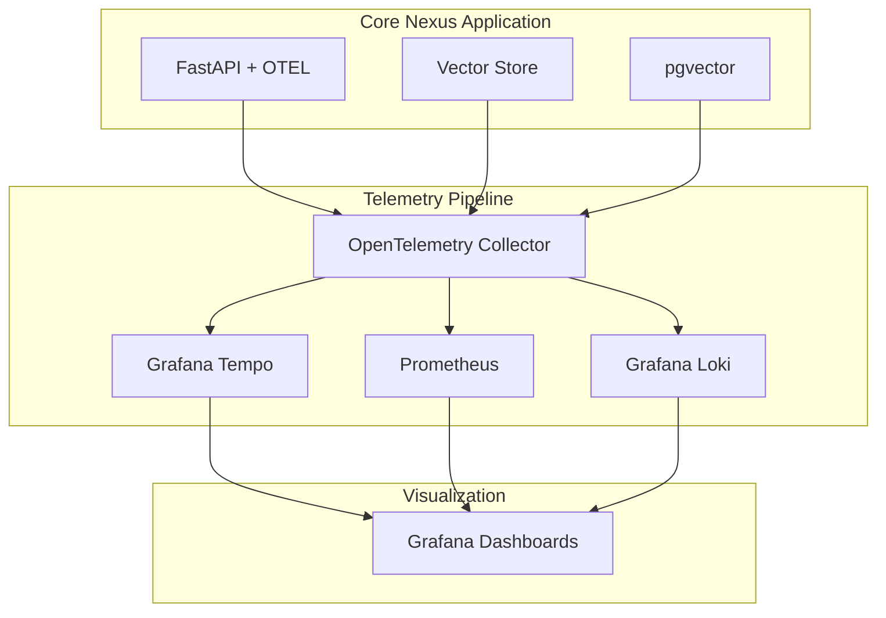

# Core Nexus Observability Implementation Plan

## Executive Summary

Implement comprehensive observability using OpenTelemetry to gain deep insights into system performance, diagnose issues faster, and enable data-driven optimization of the Core Nexus memory service.

## Why This PR Next?

### Current Pain Points
1. **Search Performance Mystery**: Recent fixes work, but we don't know WHY search was failing
2. **No Query Insights**: Can't identify slow pgvector queries or optimize indexes
3. **Blind Spots**: No visibility into embedding generation times, vector similarity calculations
4. **Debugging Difficulty**: When issues arise, limited ability to trace request flow
5. **Scaling Unknowns**: No data on resource usage patterns for capacity planning

### Business Impact
- **Reduce MTTR**: From hours to minutes with distributed tracing
- **Prevent Outages**: Proactive alerting on performance degradation
- **Optimize Costs**: Identify inefficient queries and resource usage
- **Improve UX**: Find and fix slow endpoints before users complain

## Architecture Overview



## Implementation Components

### 1. Distributed Tracing (Grafana Tempo)
- Trace every request from API to database
- Visualize pgvector query performance
- Identify bottlenecks in embedding generation
- Track multi-provider query patterns

### 2. Metrics Enhancement
- **Query Performance**: p50, p95, p99 latencies by operation type
- **Vector Operations**: Embedding generation time, similarity search duration
- **Resource Usage**: Connection pool utilization, cache hit rates
- **Business Metrics**: Memories per user, search success rates

### 3. Structured Logging (Grafana Loki)
- Correlate logs with trace IDs
- Query logs by user, operation, or error type
- Track search fallback patterns
- Monitor deduplication decisions

### 4. Custom Instrumentation
```python
# Example: Trace vector operations
@tracer.start_as_current_span("pgvector_similarity_search")
async def query_with_tracing(embedding, limit):
    span = trace.get_current_span()
    span.set_attribute("embedding.dimension", len(embedding))
    span.set_attribute("query.limit", limit)
    
    # Track index usage
    explain_plan = await conn.fetch("EXPLAIN (ANALYZE) ...")
    span.set_attribute("index.used", "hnsw" in explain_plan)
    
    # Execute query
    result = await conn.fetch(query)
    span.set_attribute("results.count", len(result))
    return result
```

## Specific Observability for Core Nexus

### 1. Vector Search Performance
- Trace embedding generation separately from search
- Monitor index scan vs sequential scan
- Track similarity threshold impact on results

### 2. Knowledge Graph Operations
- Trace entity extraction time
- Monitor relationship inference performance
- Track graph traversal patterns

### 3. Deduplication Pipeline
- Monitor each stage (hash, vector, rules)
- Track false positive rates
- Measure storage savings in real-time

### 4. Emergency Search Monitoring
- Alert when fallback search is triggered
- Track which search strategies succeed
- Monitor memories without embeddings

## Implementation Timeline

### Phase 1: Core Infrastructure (Week 1)
- Install OpenTelemetry SDK
- Configure collectors and exporters
- Set up Tempo and enhance Prometheus

### Phase 2: Application Instrumentation (Week 2)
- Auto-instrument FastAPI
- Add custom spans for vector operations
- Implement trace-correlated logging

### Phase 3: Dashboards & Alerts (Week 3)
- Create Grafana dashboards
- Set up alerting rules
- Document runbooks

## Expected Outcomes

### Immediate Benefits
1. **Diagnose Search Issues**: See exactly why searches fail
2. **Optimize Queries**: Identify slow pgvector operations
3. **Monitor Health**: Real-time system health visibility
4. **Debug Faster**: Trace requests end-to-end

### Long-term Value
1. **Data-Driven Optimization**: Make decisions based on metrics
2. **Proactive Maintenance**: Fix issues before users notice
3. **Capacity Planning**: Understand growth patterns
4. **Cost Optimization**: Identify resource waste

## Technical Advantages

### OpenTelemetry Benefits
- **Vendor Neutral**: Not locked into specific tooling
- **Auto-Instrumentation**: Minimal code changes
- **Industry Standard**: Future-proof solution
- **Comprehensive**: Traces, metrics, and logs in one

### Integration with Existing Stack
- Works with current Prometheus setup
- Enhances existing Grafana dashboards
- Compatible with Render.com deployment
- No breaking changes

## Success Metrics

1. **MTTR Reduction**: 80% faster issue diagnosis
2. **Query Performance**: Identify top 10 slow queries
3. **System Visibility**: 100% request traceability
4. **Alert Coverage**: Proactive alerts for critical paths

## Next Steps After This PR

With observability in place, we can:
1. **Optimize pgvector**: Use data to tune HNSW parameters
2. **Implement Caching**: Redis integration based on access patterns
3. **Add Read Replicas**: Scale based on query load data
4. **Performance Tune**: Halfvec implementation for 57% storage savings

This observability foundation enables all future optimizations with data-driven confidence.

## Implementation Status

### Completed ✅
1. **OpenTelemetry Core** (Phase 1)
   - Added all required dependencies to requirements.txt
   - Created `observability.py` with complete OTEL configuration
   - Implemented tracing decorators and utilities
   - Set up metric recording functions

2. **Provider Instrumentation** (Phase 2)
   - Created `providers_instrumented.py` with PgVector and ChromaDB instrumentation
   - Added detailed tracing for vector operations
   - Implemented query performance analysis
   - Added custom span attributes for debugging

3. **API Integration**
   - Integrated OTEL initialization in FastAPI lifespan
   - Added TraceRequestMiddleware for request tracing
   - Instrumented critical endpoints (store_memory, query_memories)
   - Added trace correlation to responses

4. **Unified Store Instrumentation**
   - Created `unified_store_instrumented.py`
   - Added tracing for embedding generation
   - Instrumented deduplication checks
   - Added cache performance metrics

5. **Observability Stack** (Phase 3)
   - Complete docker-compose.yml for all services
   - OpenTelemetry Collector configuration
   - Grafana Tempo setup for distributed tracing
   - Prometheus configuration for metrics
   - Loki integration for log aggregation

6. **Dashboards**
   - Core Nexus Overview dashboard with key metrics
   - Vector Operations dashboard for deep pgvector insights
   - Configured Grafana datasources and provisioning

7. **Documentation**
   - Comprehensive README in observability directory
   - Startup script for easy deployment
   - Troubleshooting guide
   - Production deployment instructions

### Next Steps 🚀
1. Test the observability stack locally
2. Create alerts for critical metrics
3. Add more custom dashboards as needed
4. Implement trace-based testing
5. Set up SLOs and error budgets