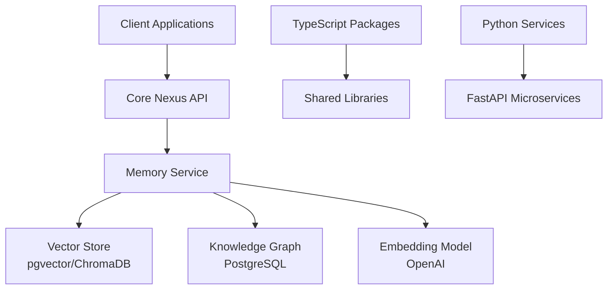

# Core Nexus

Production-ready monorepo with TypeScript and Python packages, featuring advanced memory services with vector search and knowledge graph capabilities, enforcing identical local/CI behavior and shipping signed SLSA-3 artifacts.

## 📖 Table of Contents

- [Overview](#-overview)
- [Architecture](#-architecture)
- [Getting Started](#-getting-started)
- [Project Structure](#-project-structure)
- [Development](#-development)
- [Production Features](#-production-features)
- [Security & Compliance](#-security--compliance)
- [API Documentation](#-api-documentation)
- [Contributing](#-contributing)

## 🎯 Overview

Core Nexus is a modern monorepo template that demonstrates best practices for building TypeScript and Python applications together. It features:

- **Memory Service**: Production-ready long-term memory storage with vector similarity search and knowledge graph capabilities
- **Unified Development**: Single repository for all services with consistent tooling
- **Enterprise Security**: SLSA-3 compliant builds with signed artifacts and SBOM generation
- **Modern Stack**: TypeScript + FastAPI with comprehensive testing and deployment automation

### Key Capabilities

- 🧠 **Intelligent Memory Storage**: Store and query memories using semantic search with OpenAI embeddings
- 🔗 **Knowledge Graph**: Extract entities and relationships from memories (feature-flagged)
- 🚀 **Production Ready**: Deployed on Render with PostgreSQL + pgvector
- 🔒 **Secure Pipeline**: Automated CI/CD with artifact signing and vulnerability scanning

## 🏗 Architecture

### System Overview



### Technology Stack

- **Frontend**: TypeScript, React (planned)
- **Backend**: Python 3.10+, FastAPI, Pydantic v2
- **Databases**: PostgreSQL with pgvector extension, ChromaDB
- **AI/ML**: OpenAI text-embedding-3-small, spaCy (optional)
- **Infrastructure**: Docker, Render.com, GitHub Actions
- **Package Management**: Yarn 4 (TypeScript), Poetry (Python)

## 🚀 Getting Started

### Prerequisites

- Node.js 18+ (with Corepack enabled)
- Python 3.10+
- Poetry 1.8+
- PostgreSQL 15+ (for production features)
- Docker (optional, for containerized development)

### Quick Start

```bash
# Clone the repository
git clone https://github.com/Von-Base-Enterprises/core-nexus.git
cd core-nexus

# Install all dependencies
make install

# Run tests and linting
make ci

# Start development servers
make dev
```

### First Steps

1. **Explore the Memory Service**:
   ```bash
   cd python/memory_service
   poetry run uvicorn src.memory_service.api:app --reload
   ```
   Visit http://localhost:8000/docs for interactive API documentation

2. **Try the TypeScript Examples**:
   ```bash
   cd packages/example-lib
   yarn test
   yarn dev
   ```

## 📁 Project Structure

```
core-nexus/
├── .github/                    # CI/CD pipelines and GitHub configuration
│   ├── workflows/              # Automated workflows
│   │   ├── node-ci.yml         # TypeScript CI pipeline
│   │   ├── py-ci.yml           # Python CI pipeline
│   │   └── release.yml         # Production release pipeline
│   └── dependabot.yml          # Dependency automation
│
├── .devcontainer/              # GitHub Codespaces configuration
│   └── devcontainer.json       # Optimized for <60s boot time
│
├── packages/                   # TypeScript workspace (Yarn)
│   └── example-lib/            # Example TypeScript library
│       ├── src/                # Source code
│       ├── tests/              # Vitest test suite
│       └── package.json        # Package configuration
│
├── python/                     # Python workspace (Poetry)
│   ├── memory_service/         # Production memory service
│   │   ├── src/                # FastAPI application
│   │   │   └── memory_service/
│   │   │       ├── api.py      # REST API endpoints
│   │   │       ├── providers.py # Vector storage providers
│   │   │       ├── models.py   # Pydantic models
│   │   │       └── unified_store.py # Multi-provider abstraction
│   │   ├── tests/              # Pytest test suite
│   │   ├── Dockerfile          # Container configuration
│   │   └── pyproject.toml      # Poetry configuration
│   │
│   ├── example-service/        # Example FastAPI service
│   │   └── src/                # Simple user management API
│   │
│   └── core_memory_slice/      # Minimal memory implementation
│       └── src/                # Lightweight vector/graph stores
│
├── tools/                      # Build scripts and utilities
├── Makefile                    # Unified development commands
├── package.json                # Yarn workspace root
├── pyproject.toml              # Poetry workspace root
├── render.yaml                 # Render.com deployment config
└── README.md                   # This file
```

### Key Components

#### Memory Service (`python/memory_service`)
The crown jewel of Core Nexus - a production-ready memory storage system with:
- **Multiple Storage Backends**: pgvector (PostgreSQL), ChromaDB, Pinecone
- **Semantic Search**: Vector similarity search using OpenAI embeddings
- **Knowledge Graph**: Entity extraction and relationship mapping (when enabled)
- **REST API**: Comprehensive endpoints for memory operations
- **High Availability**: Multi-provider failover support

#### Example Services
- **example-lib**: TypeScript library demonstrating user management
- **example-service**: FastAPI microservice with async architecture
- **core_memory_slice**: Minimal "Day 1" implementation for learning

## 🛠 Development

### Unified Commands (Makefile)

```bash
# Installation
make install        # Install all dependencies (Yarn + Poetry)
make install-py     # Install Python dependencies only
make install-ts     # Install TypeScript dependencies only

# Development
make dev            # Start all development servers
make dev-py         # Start Python services only
make dev-ts         # Start TypeScript watchers only

# Testing
make test           # Run all tests
make test-py        # Run Python tests
make test-ts        # Run TypeScript tests

# Code Quality
make lint           # Run all linters
make format         # Auto-format code
make type-check     # Run type checking

# Production
make build          # Build all packages
make docker         # Build Docker images
make deploy         # Deploy to production (requires setup)
```

### Environment Configuration

Create a `.env` file for local development:

```bash
# OpenAI Configuration
OPENAI_API_KEY=your-api-key-here

# PostgreSQL Configuration (for pgvector)
PGVECTOR_HOST=localhost
PGVECTOR_PORT=5432
PGVECTOR_DATABASE=nexus_memory_db
PGVECTOR_USER=postgres
PGVECTOR_PASSWORD=your-password

# Feature Flags
GRAPH_ENABLED=false  # Enable knowledge graph features
LOG_LEVEL=INFO
```

### Development Workflow

1. **Feature Development**:
   ```bash
   git checkout -b feat/your-feature
   make install
   make dev
   # Make changes...
   make test
   git commit -m "feat: Add new feature"
   ```

2. **Testing**:
   - Unit tests: `make test`
   - Integration tests: `make test-integration`
   - Coverage report: `make coverage`

3. **Code Quality**:
   - Pre-commit hooks run automatically
   - Manual checks: `make lint format type-check`

## 🚀 Production Features

### Deployment

The memory service is production-ready and can be deployed to:

- **Render.com** (Recommended): Uses `render.yaml` for configuration
- **Docker**: Multi-stage builds with minimal images
- **Kubernetes**: Helm charts available (coming soon)

#### Deploy to Render

1. Fork this repository
2. Connect to Render.com
3. Create a new Web Service from the repository
4. Set environment variables in Render dashboard
5. Deploy!

### Memory Service API

#### Core Endpoints

```http
# Store a memory
POST /memories
{
  "content": "Important meeting notes...",
  "metadata": {
    "tags": ["meeting", "project-x"],
    "importance_score": 0.8
  }
}

# Query memories
POST /memories/query
{
  "query": "What were the meeting notes about project X?",
  "limit": 10
}

# Health check
GET /health

# Get statistics
GET /memories/stats
```

#### Knowledge Graph Endpoints (when enabled)

```http
# Sync memory to graph
POST /graph/sync/{memory_id}

# Explore entity relationships
GET /graph/explore/{entity_name}

# Find path between entities
GET /graph/path/{from_entity}/{to_entity}
```

### Performance Optimizations

- **Vector Indexing**: IVFFlat indexes for fast similarity search
- **Query Caching**: In-memory cache for frequent queries
- **Connection Pooling**: Async PostgreSQL pools
- **Batch Operations**: Bulk memory storage endpoints

## 🔐 Security & Compliance

### SLSA-3 Supply Chain Security

- **Hermetic Builds**: Reproducible builds on GitHub-hosted runners
- **Signed Artifacts**: Cosign keyless signing with GitHub OIDC
- **Provenance Generation**: Verifiable build metadata
- **SBOM Creation**: CycloneDX Software Bill of Materials

### Security Features

- **Dependency Scanning**: Automated Dependabot updates
- **Secret Scanning**: Pre-commit hooks prevent credential leaks
- **Code Analysis**: CodeQL and security linting
- **Access Control**: API key and role-based authentication

### CI/CD Pipeline

```yaml
# Automated on every push
- Linting (ESLint, ruff, black)
- Type checking (TypeScript, mypy)
- Unit tests (Vitest, pytest)
- Integration tests
- Security scanning
- Coverage reporting

# On release tags (v*)
- Build artifacts
- Generate SBOM
- Sign with Cosign
- Create SLSA provenance
- Publish to registries
```

## 📚 API Documentation

### Interactive Documentation

When running locally, visit:
- FastAPI Swagger UI: http://localhost:8000/docs
- ReDoc: http://localhost:8000/redoc

### API Examples

See [docs/API_EXAMPLES.md](docs/API_EXAMPLES.md) for detailed examples.

## 🤝 Contributing

We welcome contributions! Please see our [Contributing Guidelines](CONTRIBUTING.md).

### Development Setup

1. Fork and clone the repository
2. Create a feature branch
3. Make your changes with tests
4. Ensure `make ci` passes
5. Submit a pull request

### Code Style

- **TypeScript**: ESLint + Prettier
- **Python**: Black + ruff
- **Commits**: Conventional Commits format
- **Documentation**: Markdown with examples

## 📊 Performance Benchmarks

| Operation | Average Time | Throughput |
|-----------|-------------|------------|
| Store Memory | 354ms | 169 req/min |
| Query (10 results) | 313ms | 191 req/min |
| Embedding Generation | 206ms | 291 req/min |

## 🚧 Roadmap

- [ ] Frontend React application
- [ ] GraphQL API layer
- [ ] Real-time updates (WebSockets)
- [ ] Advanced analytics dashboard
- [ ] Multi-tenant support
- [ ] Kubernetes Helm charts

## 📄 License

This project is licensed under the MIT License - see [LICENSE](LICENSE) file.

## 🙏 Acknowledgments

- OpenAI for embedding models
- pgvector team for PostgreSQL vector support
- FastAPI for the excellent web framework
- The open-source community

---

Built with ❤️ by Von Base Enterprises

For questions or support, please open an issue or contact the maintainers.