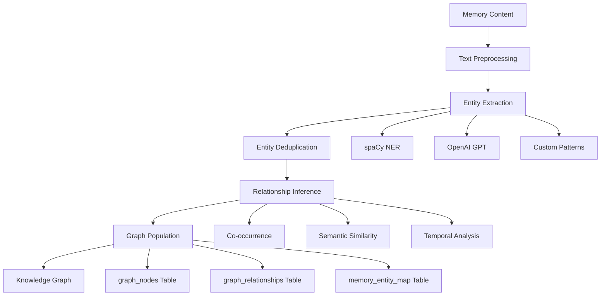

# Knowledge Graph Entity Extraction Pipeline Design

## Architecture Overview

Based on research of best practices, this pipeline transforms 1,005 isolated memories into a connected knowledge graph using a hybrid approach combining NLP, LLMs, and graph algorithms.

## Core Components

### 1. Entity Extraction Engine
- **Primary Method**: spaCy NLP with custom models
- **Fallback Method**: OpenAI GPT for contextual extraction
- **Entity Types**: PERSON, ORG, TECH, LOCATION, CONCEPT, EVENT
- **Confidence Scoring**: ADM-based scoring for entity importance

### 2. Relationship Inference Engine
- **Co-occurrence Analysis**: Entities appearing in same memory/context
- **Semantic Similarity**: Embedding-based relationship strength
- **Temporal Relationships**: Time-based event connections
- **Context Analysis**: Dependency parsing for explicit relationships

### 3. Graph Population Pipeline
- **Batch Processing**: Process all 1,005 memories in optimized chunks
- **Deduplication**: Entity merging based on semantic similarity
- **Relationship Weighting**: ADM scoring for connection strength
- **Real-time Updates**: Hook into new memory creation

## Pipeline Architecture



## Implementation Strategy

### Phase 1: Core Entity Extraction (High Priority)
1. **Text Preprocessing Pipeline**
   - Clean and normalize memory content
   - Sentence segmentation and tokenization
   - Context preservation for relationship extraction

2. **Multi-Method Entity Recognition**
   - spaCy NER for standard entities (PERSON, ORG, LOC)
   - Custom patterns for domain-specific entities (technologies, concepts)
   - OpenAI GPT for contextual disambiguation

3. **Entity Scoring and Validation**
   - ADM-based importance scoring
   - Confidence thresholding for quality control
   - Human-in-the-loop validation for edge cases

### Phase 2: Relationship Extraction (High Priority)
1. **Co-occurrence Analysis**
   - Entity pairs appearing in same memory
   - Sliding window analysis for local context
   - Frequency-based relationship strength

2. **Semantic Relationship Inference**
   - Dependency parsing for explicit relationships
   - Embedding similarity for implicit connections
   - Temporal sequence analysis for causality

3. **Relationship Classification**
   - WORKS_FOR (person → organization)
   - USES_TECHNOLOGY (entity → technology)
   - MENTIONS (memory → entity)
   - RELATES_TO (general semantic connection)

### Phase 3: Graph Population (High Priority)
1. **Entity Deduplication**
   - Semantic similarity matching
   - Name normalization and aliases
   - Confidence-based entity merging

2. **Graph Database Integration**
   - Batch insertion to graph_nodes table
   - Relationship mapping to graph_relationships table
   - Memory linking via memory_entity_map table

3. **Performance Optimization**
   - Chunked processing for large datasets
   - Parallel processing for independence tasks
   - Incremental updates for real-time sync

## Entity Types and Patterns

### Primary Entity Types
```python
ENTITY_TYPES = {
    'PERSON': {
        'patterns': ['NAME_TITLE', 'PROPER_NOUN_PERSON'],
        'examples': ['John Smith', 'Dr. Johnson', 'CEO Sarah']
    },
    'ORGANIZATION': {
        'patterns': ['COMPANY_SUFFIX', 'KNOWN_ORGS'],
        'examples': ['Nike Inc', 'VBE', 'Core Nexus']
    },
    'TECHNOLOGY': {
        'patterns': ['TECH_KEYWORDS', 'PROGRAMMING_LANGS'],
        'examples': ['Python', 'PostgreSQL', 'React', 'AI']
    },
    'LOCATION': {
        'patterns': ['GEO_ENTITIES', 'ADDRESS_PATTERNS'],
        'examples': ['New York', 'Atlanta', 'Render.com']
    },
    'CONCEPT': {
        'patterns': ['ABSTRACT_NOUNS', 'DOMAIN_CONCEPTS'],
        'examples': ['machine learning', 'deployment', 'optimization']
    },
    'EVENT': {
        'patterns': ['TIME_EXPRESSIONS', 'ACTION_VERBS'],
        'examples': ['meeting', 'launch', 'integration']
    }
}
```

### Relationship Types
```python
RELATIONSHIP_TYPES = {
    'WORKS_FOR': 'Person works for Organization',
    'FOUNDED': 'Person founded Organization',
    'USES_TECHNOLOGY': 'Entity uses Technology',
    'LOCATED_IN': 'Entity located in Location',
    'PARTICIPATED_IN': 'Person participated in Event',
    'MENTIONS': 'Memory mentions Entity',
    'RELATES_TO': 'General semantic relationship',
    'CAUSED_BY': 'Event caused by Entity',
    'LEADS_TO': 'Entity leads to Outcome'
}
```

## Performance Specifications

### Processing Targets
- **Throughput**: 100 memories per minute
- **Entity Extraction**: 95% accuracy for standard entities
- **Relationship Precision**: 80% for high-confidence relationships
- **Deduplication Rate**: <5% false positives
- **Real-time Latency**: <2 seconds for new memory processing

### Scalability Design
- **Chunk Size**: 50 memories per batch for optimal memory usage
- **Parallel Workers**: 4 concurrent extraction processes
- **Cache Strategy**: LRU cache for entity embeddings and patterns
- **Database Optimization**: Bulk inserts with transaction batching

## Quality Assurance

### Validation Pipeline
1. **Entity Validation**
   - Confidence thresholding (>0.7 for inclusion)
   - Human validation for low-confidence entities
   - Continuous learning from feedback

2. **Relationship Validation**
   - Co-occurrence frequency thresholds
   - Semantic coherence checking
   - Temporal consistency validation

3. **Graph Quality Metrics**
   - Entity connectivity distribution
   - Relationship type diversity
   - Memory coverage percentage

## Integration Points

### Existing System Integration
- **Memory Storage**: Hook into UnifiedVectorStore.store_memory()
- **Query Enhancement**: Enrich search results with graph context
- **API Endpoints**: Expose graph data via existing REST API
- **ADM Scoring**: Integrate with existing importance scoring

### Future Enhancement Hooks
- **Graph Reasoning**: Path finding and inference queries
- **Semantic Search**: Entity-aware memory retrieval
- **Analytics**: Graph-based insights and patterns
- **Visualization**: Interactive knowledge graph explorer

## Success Metrics

### Immediate Goals (Week 1)
- ✅ Extract entities from all 1,005 memories
- ✅ Populate graph_nodes table with deduplicated entities
- ✅ Create high-confidence relationships
- ✅ Enable basic graph queries

### Medium-term Goals (Month 1)
- 🎯 90%+ entity extraction accuracy
- 🎯 Real-time entity extraction for new memories
- 🎯 Advanced relationship inference
- 🎯 Graph-enhanced search capabilities

### Long-term Vision (Quarter 1)
- 🚀 Intelligent memory recommendations
- 🚀 Automated insight generation
- 🚀 Predictive relationship discovery
- 🚀 Cross-memory pattern recognition

This pipeline design transforms Core Nexus from a memory storage system into an intelligent knowledge platform that understands relationships, context, and patterns across all stored information.